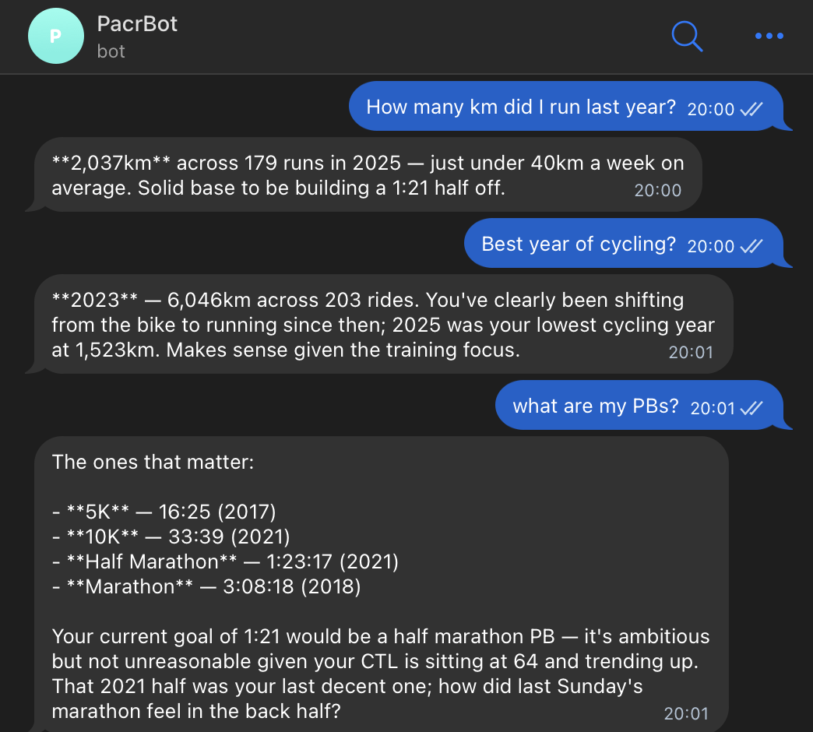
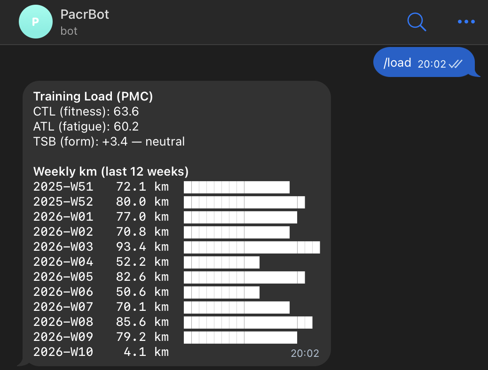
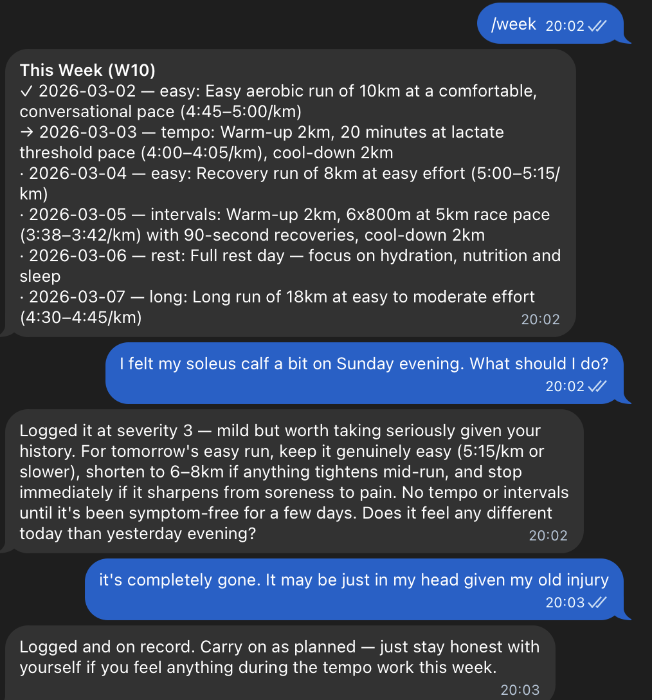

# Pacr


<p align="center">
  An AI running coach that lives in Telegram and knows your entire Strava history.
</p>

---

Ask it anything about your training. It answers from your real data, remembers what you tell it, and gives you coaching opinions — not just numbers.

```
How many km did I run last year?
→ You logged 2 036.6 km across 179 runs in 2025.

What about 2024?
→ You logged 2 148.0 km across 180 runs in 2024.

Am I ready for a half marathon in 1:30?
→ Race readiness: ON TRACK. CTL 72.4 (rising), weekly avg 68.4 km.
  Concern: longest recent run is 18 km — needs one more long effort.
```

---

## Screenshots

<table>
  <tr>
    <td align="center"><b>Conversational stats & PBs</b></td>
    <td align="center"><b>Training load (PMC)</b></td>
    <td align="center"><b>Weekly plan + injury advice</b></td>
  </tr>
  <tr>
    <td></td>
    <td></td>
    <td></td>
  </tr>
</table>

---

## What it does

### Ask anything about your training
Chat with it like a coach. It pulls from your full Strava history and understands follow-up questions — so "what about 2024?" after asking about last year just works.

- Distance totals by week, month, year, or any period
- Personal bests: fastest 5k, longest run, biggest week, longest streak
- Race history, pacing analysis, training trends
- Works across all sports — running, cycling, hiking, swimming, walking

### Post-run debrief & long-term memory
When a new activity is detected, the bot prompts you to rate how it felt (RPE 1–10). That feedback is saved to a local vector store and surfaced in future conversations — so the coach gets to know you over time.

```
🏃 New run detected: "Tuesday Tempo" — 12.4 km @ 4:32/km
How did that feel? Reply with RPE 1–10 (or "skip").

→ 7 — legs were heavy in the last 3 km

RPE 7/10 logged.
```

### Training load & race readiness
See your fitness, fatigue and form (CTL/ATL/TSB) at a glance, with a 12-week weekly km chart. Ask whether you're ready for a specific race and goal time — the bot cross-checks your current load, long run coverage and VDOT.

### Weekly plan & adherence
Generate a structured training plan for any goal race and target time, following Jack Daniels' methodology. See today's session, this week vs plan, and a percentage adherence score over any number of weeks.

### Injury & wellness tracking
Log niggles in plain language. The bot tracks them over time, detects patterns (e.g. recurring knee soreness after long runs), and factors them into its coaching advice.

```
My left knee has been a bit sore after long runs, about a 3/10.
→ Logged. I'll keep an eye on it.

Any injury patterns I should know about?
→ ⚠ recurring_soreness: left knee — 3 entries in 14 days.
```

### Automatic Strava sync
Strava activities are synced automatically every 30 minutes. New activities are detected, analysed and sent to the chat without you doing anything.

---

## Getting Started

### What you'll need

- A [Strava API application](https://www.strava.com/settings/api) (free — takes ~2 minutes to create)
- A [Telegram bot](https://t.me/BotFather) token (free — create via @BotFather)
- An [Anthropic API key](https://console.anthropic.com/) for Claude
- Python 3.12+ and [uv](https://docs.astral.sh/uv/) installed locally

### Setup

```bash
# 1. Clone the repo
git clone <repo-url> Pacr
cd Pacr

# 2. Install dependencies
uv sync --extra dev

# 3. Copy the example config and fill in your keys
cp .env.example .env
# Edit .env — add STRAVA_CLIENT_ID, STRAVA_CLIENT_SECRET,
#              TELEGRAM_BOT_TOKEN, TELEGRAM_CHAT_ID, ANTHROPIC_API_KEY

# 4. Authorise with Strava (opens a browser window)
uv run src/strava_utils/strava_auth.py authorize

# 5. Sync your activities
uv run src/strava_utils/strava_sync.py sync

# 6. Set your HR zones (replace 190 with your max HR)
uv run src/coach_utils/training_load.py zones 190

# 7. Start the bot
uv run src/tgbot/bot.py bot
```

Once the bot is running, open Telegram and send `/start`.

> **Tip — find your Telegram chat ID:**
> ```bash
> curl "https://api.telegram.org/bot<TOKEN>/getUpdates" | jq '.result[0].message.chat.id'
> ```

### Running with Docker

The easiest way to keep the bot running continuously:

```bash
# Build and start in the background
just docker-build
just docker-up

# Follow logs
just docker-logs

# Stop
just docker-down
```

All data (activities, plan, memory) is stored in `./data` on your host and persists across restarts.

---

## Commands

| Command | What it does |
|---------|-------------|
| `/start` | Overview of your status and today's session |
| `/sync [days]` | Sync Strava activities (default: last 365 days) |
| `/today` | Today's prescribed training session |
| `/week` | This week's plan vs what you've completed |
| `/next` | Next 5 upcoming sessions |
| `/last` | Full breakdown of your last activity |
| `/summary` | Last 7 days: distance, time, pace |
| `/plan` | Full training plan overview |
| `/setplan <goal>` | Generate a new AI training plan — e.g. `/setplan half marathon on April 3 2026 in 1:21h` |
| `/analyse` | Analyse last activity: pacing flags, HR zones, coaching opinion |
| `/reanalyse` | Re-run analysis on the last activity |
| `/load` | Training load: CTL (fitness), ATL (fatigue), TSB (form) + weekly km chart |
| `/adherence [weeks]` | Plan adherence score — e.g. `/adherence 8` |
| `/results` | Cached race results |
| `/zones` | Your HR and pace training zones |
| `/sport [type]` | Filter by sport: `run` / `ride` / `hike` / `swim` / `walk` / `all` |
| `/clear` | Clear conversation history |
| `/help` | List all commands |

You can also send any free-text message to chat directly with the coach.

---

## All the things you can ask

### Distance & mileage

```
How many km did I run last year?
What about 2024?
What's my biggest month ever?
Best year for cycling?
How far have I walked this month?
```

### Personal records

```
What are my PBs?
What's my longest run ever?
What was my fastest 10k?
Biggest week I've ever had?
```

### Training history

```
Show me my races from 2024
What was my longest run in January?
How many runs did I do over 30 km?
```

### Training load & race readiness

```
How's my training load?
Am I ready for a half marathon in 1:30?
Is my CTL high enough for a marathon?
```

### Plan & adherence

```
How well have I been sticking to my plan?
/adherence 8
Move Tuesday's tempo run to Thursday.
Make next week a recovery week.
```

### Splits & pacing

```
How were my splits on Thursday's run?
Was my last race evenly paced?
```

### Wellness & injuries

```
My left knee has been a bit sore, about a 3/10.
Any injury patterns I should know about?
My knee is fine now.
```

### Switching sport

```
/sport ride    → all commands now show only rides
/sport all     → back to all sports
```

---

## Technical Details

<details>
<summary>Project structure</summary>

```
Pacr/
├── src/
│   ├── _token_utils.py          # Shared token management (stdlib only)
│   ├── strava_utils/
│   │   ├── strava_auth.py       # OAuth setup
│   │   ├── strava_sync.py       # Activity sync + cache (retry/backoff)
│   │   └── pot10.py             # Power of 10 results [EXPERIMENTAL]
│   ├── coach_utils/
│   │   ├── analyze.py           # Session analysis
│   │   ├── plan.py              # Training plan management
│   │   └── training_load.py     # CTL/ATL/TSB metrics
│   ├── memory/
│   │   └── store.py             # ChromaDB vector memory
│   └── tgbot/
│       ├── bot.py               # Entry point
│       ├── handlers.py          # Command handlers
│       ├── claude_chat.py       # Claude tool definitions + orchestration
│       ├── context.py           # Athlete context + VDOT helpers
│       ├── formatters.py        # Telegram HTML formatters
│       ├── debrief.py           # RPE debrief storage
│       └── km_query.py          # Local distance queries
├── config/
│   ├── SOUL.md                  # Coaching personality
│   ├── AGENTS.md                # Agent behaviour rules
│   └── athlete-profile.md       # Athlete intake template
├── docker/
│   ├── Dockerfile.skills
│   └── docker-compose.yml
└── tests/
```

</details>

<details>
<summary>Data files (stored in data/, gitignored)</summary>

| File | Contents |
|------|----------|
| `tokens.json` | Strava OAuth tokens |
| `athlete.json` | Strava athlete profile |
| `activities.json` | Cached Strava activities |
| `race_results.json` | Race results |
| `training_plan.json` | Current training plan |
| `athlete_zones.json` | HR and pace zones |
| `training_log.json` | Analysed session history |
| `debriefs.json` | Post-run RPE debriefs |
| `conversation_history.json` | Telegram chat history |
| `chroma/` | ChromaDB vector store (coaching memory) |

</details>

<details>
<summary>Development commands</summary>

```bash
just setup       # install dev deps
just lint        # ruff check
just fix         # ruff auto-fix
just fmt         # ruff format
just typecheck   # mypy
just test        # pytest
just test-cov    # pytest with coverage
just auth        # Strava OAuth authorisation
just auth-status # check token validity
```

</details>

<details>
<summary>Race results — Power of 10</summary>

> ⚠ **Experimental**: The Power of 10 website is being rebuilt and web scraping is unreliable. Manual entry is the recommended workflow:

```bash
uv run src/strava_utils/pot10.py add --date=2025-06-15 --event=parkrun --distance=5K --time=22:30
```

</details>

<details>
<summary>GCP deployment (future)</summary>

For a production-grade, always-on deployment:

- **Cloud Run** — containerised bot, scales to zero between messages
- **Cloud Scheduler** — daily sync cron + morning briefing
- **Secret Manager** — replace `.env` with GCP-managed secrets
- **Artifact Registry + Cloud Build** — push to `main` → build → deploy
- **Estimated cost** — ~$5–10/month

</details>
