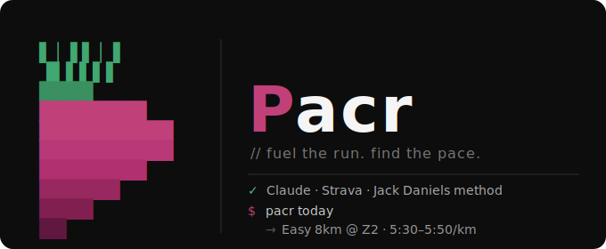

# Pacr



AI running coach powered by Claude. Analyses Strava data, looks up race results, and manages training plans following Jack Daniels' Running Formula methodology.

## Overview

Claude calls Python scripts via `uv run` to pull data and manage training. All data persists as JSON in `data/`. The interactive Telegram bot provides a conversational coaching interface with automatic Strava syncing every 30 minutes.

## Quick Start

### Prerequisites

- Python 3.12+
- [uv](https://docs.astral.sh/uv/)
- [just](https://github.com/casey/just) (optional, for dev commands)
- A [Strava API application](https://www.strava.com/settings/api)
- A [Telegram bot](https://t.me/BotFather) token and chat ID

### Setup

```bash
# 1. Clone the repository
git clone <repo-url> Pacr
cd Pacr

# 2. Install dev dependencies
just setup

# 3. Copy and fill in credentials
cp .env.example .env
# Edit .env with your Strava, Telegram, and Anthropic keys

# 4. Authorise with Strava (opens browser)
just auth

# 5. Set your HR zones (replace 190 with your max HR)
just zones 190

# 6. Start the interactive bot
just tg-bot

# — or — run in Docker
just docker-build
just docker-up
```

### Telegram chat ID

After creating your bot via @BotFather, fetch your chat ID:

```bash
curl "https://api.telegram.org/bot<TOKEN>/getUpdates" | jq '.result[0].message.chat.id'
```

## Telegram Bot Commands

| Command | Description | Example |
|---------|-------------|---------|
| `/start` | Greeting and status overview | `/start` |
| `/sync` | Sync Strava activities | `/sync` |
| `/today` | Today's prescribed session | `/today` |
| `/week` | This week's plan vs completed sessions | `/week` |
| `/next` | Next 5 upcoming sessions | `/next` |
| `/last` | Full detail on the last activity | `/last` |
| `/summary` | Last 7 days: distance, time, pace | `/summary` |
| `/plan` | Training plan overview | `/plan` |
| `/setplan <goal>` | Generate a new plan with AI | `/setplan half marathon on April 3 2026 in 1:21h` |
| `/analyse` | Analyse last activity: flags, coaching opinion & debrief | `/analyse` |
| `/results` | Cached race results | `/results` |
| `/load` | Training load: CTL/ATL/TSB + weekly km | `/load` |
| `/reanalyse` | Re-analyse last activity on demand | `/reanalyse` |
| `/zones` | HR and pace training zones | `/zones` |
| `/clear` | Clear conversation history | `/clear` |
| `/help` | Show all commands | `/help` |

You can also send free-text messages to chat directly with your AI coach.

### Automatic Strava sync

The bot polls Strava every 30 minutes (configurable via `STRAVA_POLL_INTERVAL` in `.env`). When a new activity is detected it is automatically analysed and a coaching note is sent to the chat. The delay before auto-analysis is controlled by `STRAVA_ANALYSIS_DELAY` (default: 600s / 10 min). Set `LOG_FORMAT=json` for structured JSON log output.

## Docker

Build and run the Telegram bot in a container with automatic restart:

```bash
# Build image
just docker-build

# Start the bot in the background
just docker-up

# Follow logs
just docker-logs

# Stop
just docker-down
```

The `data/` directory is stored in a named Docker volume (`running-coach-data`) so activity and plan data persists across container restarts.

## Development

```bash
just setup       # install dev deps
just lint        # ruff check
just fix         # ruff auto-fix
just fmt         # ruff format
just typecheck   # mypy
just test        # pytest
just test-cov    # pytest with coverage
just pre-commit  # install ruff pre-commit hooks
just sync        # fetch Strava activities (last 365 days)
just plan        # show current training plan
just auth        # Strava OAuth authorisation
just auth-status # check Strava token validity
```

## Project Structure

```
Pacr/
├── CLAUDE.md                    # AI agent project context
├── src/
│   ├── _token_utils.py          # Shared token management (stdlib only)
│   ├── strava_utils/
│   │   ├── strava_auth.py       # OAuth setup
│   │   ├── strava_sync.py       # Activity sync + cache (retry/backoff)
│   │   └── pot10.py             # Power of 10 results [EXPERIMENTAL]
│   ├── coach_utils/
│   │   ├── analyze.py           # Session analysis
│   │   ├── plan.py              # Training plan management
│   │   └── training_load.py     # CTL/ATL/TSB training load metrics
│   └── tgbot/
│       ├── __init__.py
│       ├── bot.py               # Thin entry point + fire CLI
│       ├── handlers.py          # Command handlers + BotConfig state
│       ├── claude_chat.py       # Claude tool defs + orchestration
│       ├── formatters.py        # HTML formatters and data helpers
│       ├── context.py           # Athlete context + VDOT helpers
│       ├── debrief.py           # Post-run RPE debrief storage
│       └── km_query.py          # Local km/distance queries (no API)
├── config/
│   ├── SOUL.md                  # Coaching personality
│   ├── AGENTS.md                # Agent behaviour rules
│   └── athlete-profile.md       # Athlete intake template
├── docker/
│   ├── Dockerfile.skills
│   └── docker-compose.yml
├── tests/
└── data/                        # Runtime data (gitignored)
```

## Data Files

All stored in `data/` (gitignored):

| File | Contents |
|------|----------|
| `tokens.json` | Strava OAuth tokens (chmod 600) |
| `athlete.json` | Strava athlete profile |
| `activities.json` | Cached Strava activities |
| `race_results.json` | Power of 10 + manual results |
| `training_plan.json` | Current training plan |
| `athlete_zones.json` | HR and pace zones |
| `training_log.json` | Analysed session history |
| `debriefs.json` | Post-run RPE debriefs |
| `conversation_history.json` | Telegram chat history |

## Race Results — Power of 10

> ⚠ **Experimental**: The Power of 10 website is being rebuilt and web scraping
> is unreliable. Manual entry is the recommended primary workflow:

```bash
uv run src/strava_utils/pot10.py add --date=2025-06-15 --event=parkrun --distance=5K --time=22:30
```

Web fetch (may fail):

```bash
uv run src/strava_utils/pot10.py fetch --athlete_id=123456 --verbose
```

## Future Improvements / GCP Deployment

For a production-grade, always-on deployment:

- **Cloud Run** — containerised bot with `gcloud run deploy`, scales to zero between messages
- **Cloud Scheduler** — daily sync cron job + 07:00 morning briefing (replaces `STRAVA_POLL_INTERVAL`)
- **Secret Manager** — replace `.env` file with GCP-managed secrets (`TELEGRAM_BOT_TOKEN`, `STRAVA_CLIENT_SECRET`, `ANTHROPIC_API_KEY`)
- **Artifact Registry + Cloud Build** — CI/CD pipeline: push to `main` → build image → deploy to Cloud Run
- **Estimated cost** — ~$5–10/month (Cloud Run min instances + Scheduler invocations + Secret Manager)
